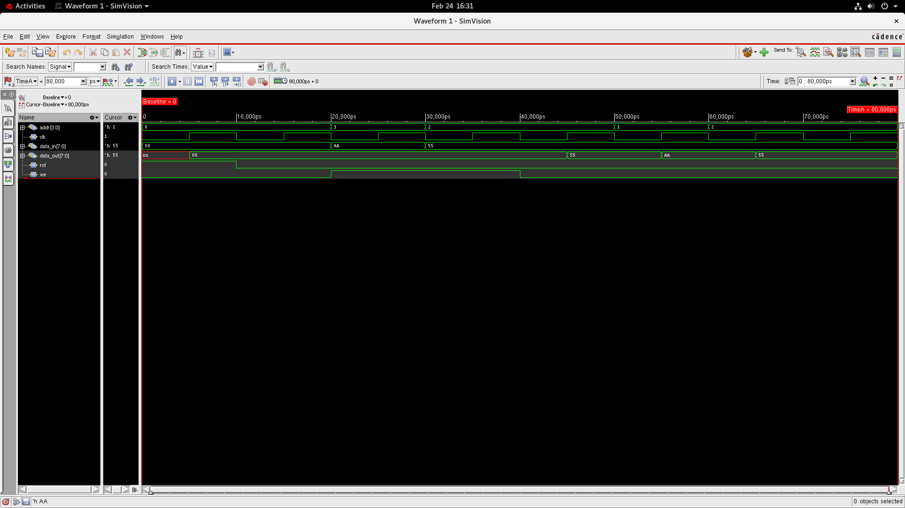

# SYNCHRONOUS RANDOM ACCESS MEMORY (RAM)

**COMPANY:** CODTECH IT SOLUTIONS  
**NAME:** Likhith Gowda H R  
**INTERN ID:** CTISAR20  
**DOMAIN:** VLSI  
**DURATION:** 4 Weeks  
**MENTOR:** Neela Santosh  

---

## 📌 Project Overview

This project presents the design and simulation of a Synchronous Random Access Memory (RAM) using Verilog Hardware Description Language (HDL). RAM is an essential component of digital systems responsible for storing and retrieving data in processors, embedded systems, and communication devices.

The implemented RAM performs memory read and write operations based on clock and write enable control signals. All operations occur in synchronization with the clock, ensuring stable and reliable data transfer. The design is verified using simulation waveforms and synthesized using Cadence Genus to evaluate hardware performance such as power consumption, timing performance, and area utilization.

---

## 🎯 Objective

- Design a synchronous RAM using Verilog HDL  
- Implement clock-based memory read and write operations  
- Verify functionality using simulation waveform  
- Perform synthesis and analyze power, timing, and area performance  

---

## ⚙️ Tools Used

- Verilog Hardware Description Language (HDL)  
- Cadence Genus  
- SimVision  

---

## 💻 Source Code

### 🔹 RAM Design (`syncram.v`)
Implements synchronous memory operations using clock, write enable, address, and data input signals. The design stores data in memory locations and retrieves stored data based on control signals.

### 🔹 Testbench (`syncram_tb.v`)
Applies different input combinations to verify RAM functionality and generates simulation waveforms.

Source files are available in the **Source_Code** folder.

---

## 🧠 RAM Operation

| Control Condition | Operation |
|---|---|
| Write Enable = 1 (Clock Edge) | Data is written into selected memory location |
| Write Enable = 0 (Clock Edge) | Stored data is read from memory |

Memory operations occur only at the positive edge of the clock signal.

---

## 🖥 Simulation Output

The simulation waveform verifies correct memory read and write operations based on clock, address, and write enable signals.

---

## 🔧 RTL Schematic

The RTL schematic shows the synthesized hardware structure of the synchronous RAM generated from the Verilog design.

---

## 📊 Synthesis Reports

Power, timing, area, and gate-level reports are available in the **Synthesis_Reports** folder.

---

## 📄 Project Documentation

 **[RAM SIMULATION REPORT](Project_Report/RAM%20SIMULATION%20REPORT.pdf)**

The report includes design methodology, simulation waveform analysis, RTL schematic, synthesis reports, and results.

---

## ✅ Results

Simulation confirms correct memory storage and retrieval operations. Synthesis analysis shows efficient hardware utilization with acceptable power consumption and timing performance. The design operates reliably under clock-controlled conditions.

---

## 🚀 Future Enhancements

- Extend memory size to higher bit-width RAM  
- Implement multi-port memory architecture  
- Optimize power and area performance  
- Integrate RAM into processor-based systems
